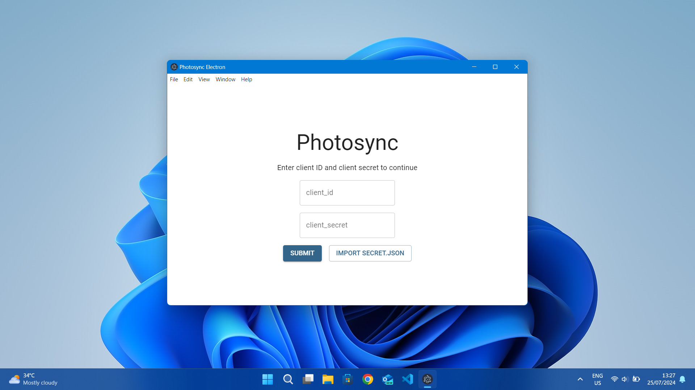
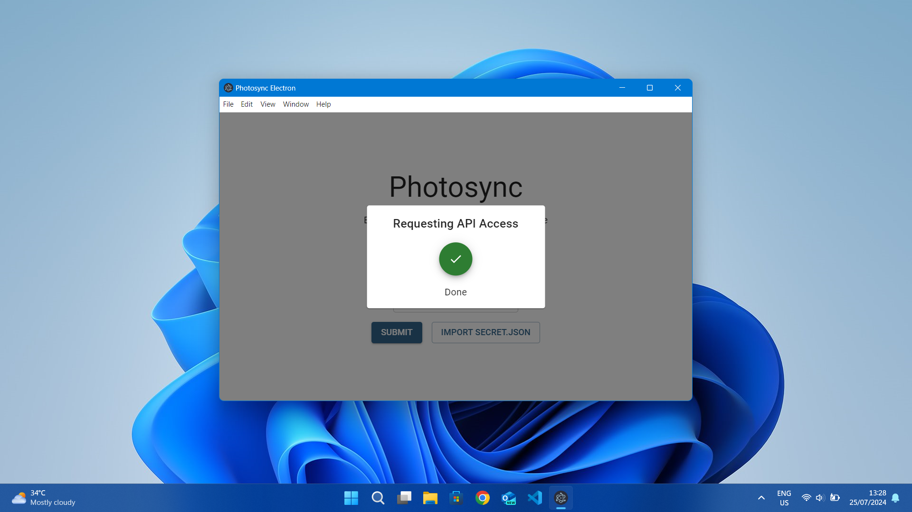
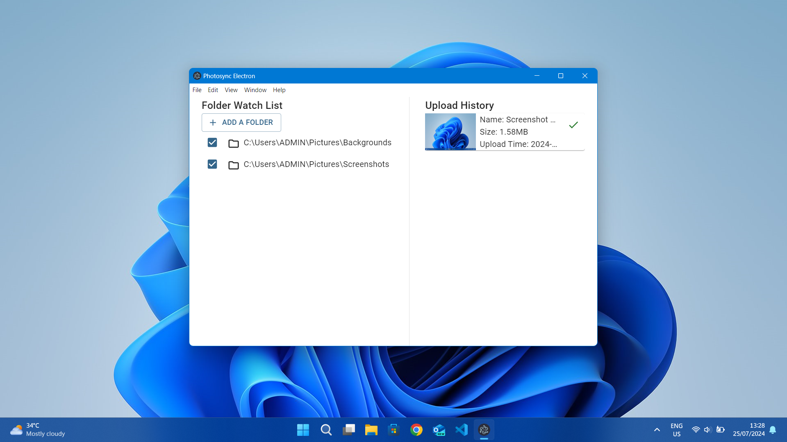
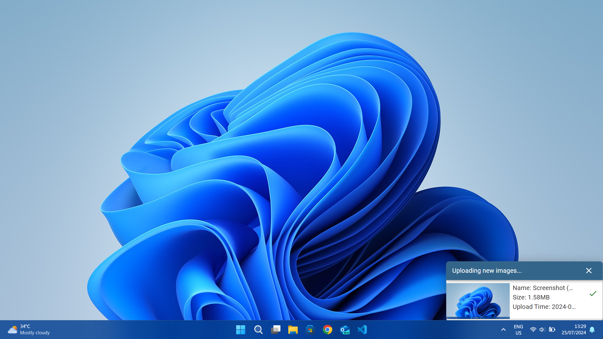

# Photosync Electron

Backup images and videos from PC to Google Photos without using Google's clunky Drive Client 

This is a rework of my old project [PhotoSync](https://www.github.com/letiendat198/Photosync), which was written in Rust and lack a GUI. It's also quite inconvenient. It has bugged me for long enough so now here we are.

All features are functional by now (though things may fail because I haven't done any errors handling)

## Screenshots

|Setup|Setup Successful|Main App|Notification|
|---|---|---|---|
|||||

## Features
- Backup images and videos to Google Photos
- Allow choosing which folder to backup
- Convenient ON/OFF toggle in system tray
- Custom backup notification

## How to use
- Download a build at [releases](https://www.github.com/letiendat198/photosync_electron/releases/)
- Make sure you have your own Google API OAuth credential. For how to create one, please refer to [this](https://developers.google.com/photos/library/guides/get-started) guide
**Note**: In step 2 (Request an OAuth 2.0 client ID), set the **application type** to **Desktop** and skip the rest of the guide

-  Enter your client ID and client secret when prompted and you're all set
- To completely exit, check your system tray (bottom right corner of the taskbar) for a photo icon. Right click => Exit
- **Warning**: This app stores your credentials in **plain text JSON files**. Although your credentials stay on your machine and only used when communicating with Google, there exists a chance that they can be stolen if your computer or network is compromised. **Only use credentials associated with a FREE Google Cloud account with this application**

## TODO

    
Already done

    
    - Done setup screen => OAuth works
    - Add folder to watch list works
    - File detection and upload works
    - Fix removing folders
    - Implement upload history and status
    - Implement a early state working custom notification
    - Implement custom notification:
        - Redesign custom title bar
        - Not show notification when main app is open 
        - An auto close mechanism
    - ~~Save upload history to disk and load it on startup~~ (Not a good idea)
    - Implement tray toggle:
        - Implemented open main window
        - Implemented quitting the app entirely
        - ON/OFF toggle to turn of sync
    - Save and reload watch list on startup
    - Detect when setup is needed
    - Added tooltip to show overflown text

- Handle possible errors when doing OAuth and API
- Handle possible errors with upload status
- Use ffmpeg to support video formats that Google doesn't support

## Known Issues

    
Fixed

    
    - First notification entry will be invisible? (Fixed by route to notification before hiding)

- High memory consumption (~ 200MB)

## License

    Photosync Electron is free software: you can redistribute it and/or modify it under the terms of the GNU General Public License as published by the Free Software Foundation, either version 3 of the License, or (at your option) any later version.
    This program is distributed in the hope that it will be useful, but WITHOUT ANY WARRANTY; without even the implied warranty of MERCHANTABILITY or FITNESS FOR A PARTICULAR PURPOSE. See the GNU General Public License for more details.
    You should have received a copy of the GNU General Public License along with this program. If not, see <https://www.gnu.org/licenses/>. 